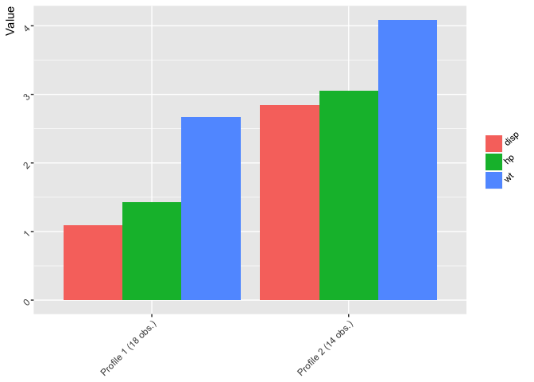

<!-- README.md is generated from README.Rmd. Please edit that file -->
prcr
====

`prcr` is an `R` package for person-centered analysis. Person-centered analyses focus on clusters, or profiles, of observations, and their change over time or differences across factors. See [Bergman and El-Khouri (1999)](http://onlinelibrary.wiley.com/doi/10.1002/(SICI)1521-4036(199910)41:6%3C753::AID-BIMJ753%3E3.0.CO;2-K/abstract) for a description of the analytic approach. See [Corpus and Wormington (2014)](http://www.tandfonline.com/doi/abs/10.1080/00220973.2013.876225) for an example of person-centered analysis in psychology and education.

Example
=======

In this example using the built-in to R `mtcars` data for fuel consumption and other information for 32 automobiles, the variables `disp` (for engine displacement, in cu. in.), `qsec` (for the 1/4 mile time, in seconds), and `wt` for weight (in 1000 lbs.) are clustered with a `2` cluster solution specified. Because the variables are in very different units, the `to_scale` argument is set to `TRUE`.

``` r
library(prcr)

df <- mtcars

two_profile_solution <- create_profiles(df, 
                                        disp, hp, wt,
                                        n_profiles = 2, 
                                        to_scale = T)
#> Prepared data: Removed 0 incomplete cases
#> Hierarchical clustering carried out on: 32 cases
#> K-means algorithm converged: 1 iteration
#> Clustered data: Using a 2 cluster solution
#> Calculated statistics: R-squared = 0.654

summary(two_profile_solution)
#> 2 cluster solution (R-squared = 0.654)
#> 
#> Profile n and means:
#> 
#> # A tibble: 2 x 4
#>               Cluster     disp       hp       wt
#>                 <chr>    <dbl>    <dbl>    <dbl>
#> 1 Profile 1 (18 obs.) 1.093596 1.430155 2.666499
#> 2 Profile 2 (14 obs.) 2.848989 3.051423 4.087264

print(two_profile_solution)
#> $clustered_processed_data
#> 
#> # A tibble: 2 x 4
#>               Cluster     disp       hp       wt
#>                 <chr>    <dbl>    <dbl>    <dbl>
#> 1 Profile 1 (18 obs.) 1.093596 1.430155 2.666499
#> 2 Profile 2 (14 obs.) 2.848989 3.051423 4.087264

plot(two_profile_solution)
```



The output has the class `prcr` and has slots for additional information that can be extracted from it, such as the original data with the clustering assignment added, the r-squared (for comparing the relative fit of different cluster solutions) raw clustered data (i.e., for conducting statistical tests to determine whether the cluster centroids are different from one another and for use in additional analyses) and the processed data (i.e., for creating different plots of the cluster centroids).

``` r
two_profile_solution$.data
#> # A tibble: 32 x 12
#>      mpg   cyl  disp    hp  drat    wt  qsec    vs    am  gear  carb
#>    <dbl> <dbl> <dbl> <dbl> <dbl> <dbl> <dbl> <dbl> <dbl> <dbl> <dbl>
#>  1  21.0     6 160.0   110  3.90 2.620 16.46     0     1     4     4
#>  2  21.0     6 160.0   110  3.90 2.875 17.02     0     1     4     4
#>  3  22.8     4 108.0    93  3.85 2.320 18.61     1     1     4     1
#>  4  21.4     6 258.0   110  3.08 3.215 19.44     1     0     3     1
#>  5  18.7     8 360.0   175  3.15 3.440 17.02     0     0     3     2
#>  6  18.1     6 225.0   105  2.76 3.460 20.22     1     0     3     1
#>  7  14.3     8 360.0   245  3.21 3.570 15.84     0     0     3     4
#>  8  24.4     4 146.7    62  3.69 3.190 20.00     1     0     4     2
#>  9  22.8     4 140.8    95  3.92 3.150 22.90     1     0     4     2
#> 10  19.2     6 167.6   123  3.92 3.440 18.30     1     0     4     4
#> # ... with 22 more rows, and 1 more variables: cluster <int>
two_profile_solution$r_squared
#> [1] 0.6544283
two_profile_solution$clustered_raw_data
#> # A tibble: 32 x 4
#>         disp        hp       wt cluster
#>        <dbl>     <dbl>    <dbl>   <int>
#>  1 1.2909608 1.6043669 2.677684       1
#>  2 1.2909608 1.6043669 2.938298       1
#>  3 0.8713986 1.3564193 2.371079       1
#>  4 2.0816744 1.6043669 3.285784       1
#>  5 2.9046619 2.5524020 3.515738       2
#>  6 1.8154137 1.5314412 3.536178       1
#>  7 2.9046619 3.5733627 3.648600       2
#>  8 1.1836497 0.9042796 3.260234       1
#>  9 1.1360455 1.3855896 3.219353       1
#> 10 1.3522815 1.7939739 3.515738       1
#> # ... with 22 more rows
two_profile_solution$clustered_processed_data
#> # A tibble: 2 x 4
#>               Cluster     disp       hp       wt
#>                 <chr>    <dbl>    <dbl>    <dbl>
#> 1 Profile 1 (18 obs.) 1.093596 1.430155 2.666499
#> 2 Profile 2 (14 obs.) 2.848989 3.051423 4.087264
```

Comparison of R-squared values can be carried out as follows:

``` r
r_squared_output <- plot_r_squared(df, 
                                   disp, hp, wt,
                                   to_scale = T,
                                   r_squared_table = TRUE,
                                   lower_bound = 2, upper_bound = 4)
r_squared_output
#>   cluster r_squared_value
#> 1       2           0.654
#> 2       3           0.750
#> 3       4           0.833
```

Cross-validation is now able to be carried out, in this example for the two-profile solution, although `n_profiles` can also be set to the character string`"iterate"` in order to explore cross-validation output for a range of profile solutions:

``` r
cross_validation_output <- cross_validate(df,
                                          disp, hp, wt,
                                          to_scale = TRUE,
                                          n_profiles = 2,
                                          distance_metric = "squared_euclidean",
                                          linkage = "complete", 
                                          k = 30)
cross_validation_output
#> # A tibble: 30 x 3
#>    k_iteration kappa percentage_agree
#>          <int> <dbl>            <dbl>
#>  1           1  1.00             1.00
#>  2           2  0.87             0.94
#>  3           3  1.00             1.00
#>  4           4  1.00             1.00
#>  5           5  1.00             1.00
#>  6           6    NA               NA
#>  7           7    NA               NA
#>  8           8  0.87             0.94
#>  9           9  0.87             0.94
#> 10          10  0.87             0.94
#> # ... with 20 more rows
```
